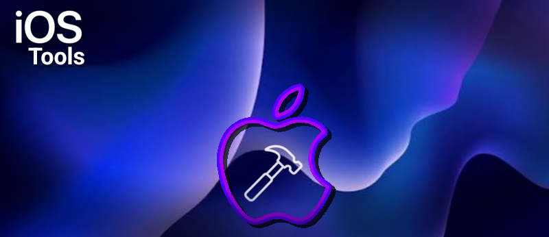

---

A simple, modular iOS utility library designed to make native iOS development feel easy—similar to `extension-androidtools`. 

It allows you to request permissions, pop up system alerts, save small data items, trigger vibrations, and check hardware stats using clean, simple code.

---

## Some code examples

### 1. Show an Alert & Request Camera
```swift
// Show a simple popup
IOSTools.shared.ui.showAlert(title: "Hello!", message: "Welcome to our application.")

// Request camera permission
IOSTools.shared.permissions.request(.camera) { granted in
    if granted {
        print("Camera access approved!")
    }
}
```

### 2. Save a High Score & Check Battery
```swift
// Save data instantly
IOSTools.shared.storage.save(key: "HighScore", value: 9999)

// Get device info
let battery = IOSTools.shared.device.batteryLevel
print("Current battery level is: \(battery)%")
```

---

## IMPORTANT NOTE!

Because iOS values user privacy, your app **will crash** if you do not explain *why* you are asking for permissions. You must add the following descriptions to your project configuration before running it.
